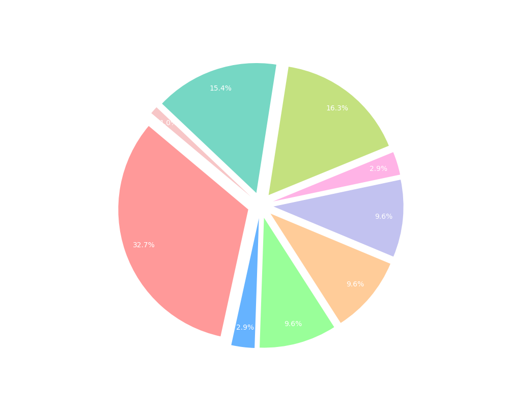

    <h1>Hello, I'm Rohith! </h1>

<h3 align="center">Interested in : Data Science | Machine Learning | Software Development </h3>

# 💫 About Me:
🔭 Working on **VR StorySphere - VR based Storytelling App** 🧑‍🎓 Currently pursuing **Master's in Data Science and Analytics**

#  🔧Tool Box:

  

                     

<table>
  <tr>
    <td valign="top" width="50%">

## 🌐 Socials:

## 🎓 Certifications

Proudly acquired certifications that underscore my expertise:

- Microsoft Certified: Power BI Data Analyst Associate
- Certified SAFe5 Practitioner

    </td>
    <td valign="top" width="50%">

## 💻 Technologies Used

</td>
</tr>
</table>

### 🎨 Dynamic Contributions
<picture>
  <source media="(prefers-color-scheme: dark)" srcset="https://raw.githubusercontent.com/RohithGSVV/RohithGSVV/output/github-contribution-grid-snake-dark.svg">
  <source media="(prefers-color-scheme: light)" srcset="https://raw.githubusercontent.com/RohithGSVV/RohithGSVV/output/github-contribution-grid-snake.svg">
  
</picture>

---

